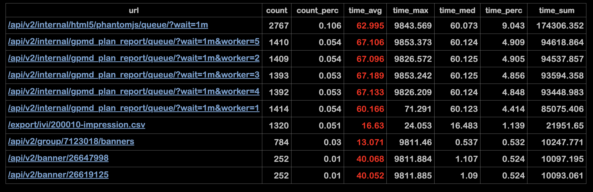
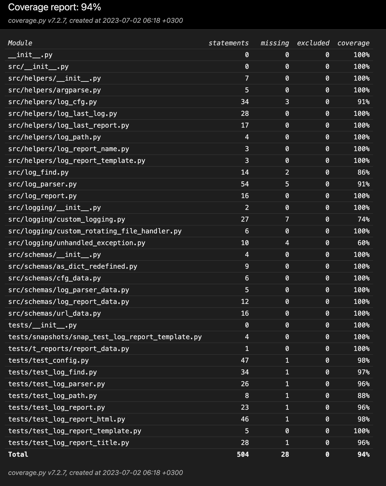

## ДЗ №1

### Poker: не выполнялся.

### Deco: выполнено.

> pp_hw_01/deco/deco.py

main output соответствует заданию:

```text
7
9
7
54
Sum docstring
addition was called 4 times
12
24
24
Multiply docstring
multiplication was called 3 times
_ --> fib(3)
__ --> fib(2)
___ --> fib(1)
___ <-- fib(1) == 1
____ --> fib(0)
____ <-- fib(0) == 1
__ <-- fib(2) == 2
_____ --> fib(1)
_____ <-- fib(1) == 1
_ <-- fib(3) == 3
fib(3) = 3
Fibonacci docstring
5 fib calls made
```

### Анализатор логов 'Log Analyzer': выполнено.

> pp_hw_01/log_analyzer/main.py

Как использовать приложение:

```commandline
cd log_analyzer
python main.py --help
```

```text
usage: log_analyzer.py [-h] [--config CONFIG]

app for log parsing

options:
  -h, --help       show this help message and exit
  --config CONFIG  Path to the config file.

```

Пользователь указывает abs path к файлу конфигурации .ini, .conf:
Добавим тестовый config file pp_hw_01/l_usr_cfg/usr_cfg.ini:

[](images/img_01.png)

со следующими значениями:

```ini
[DEFAULT]
LOG_DIR = ./usr_logs
REPORT_DIR = ./usr_reports
REPORT_SIZE = 10
```

сообщения в консоли:

[](images/img_02.png)

Использован файл конфигурации пользователя, папка с логами для обработки не найдена.
Теперь заменим в файле конфигурации путь к логам на существующий:

```ini
[DEFAULT]
LOG_DIR = ./log_default
REPORT_DIR = ./usr_reports
REPORT_SIZE = 10
```

и перезапустим приложение:

[](images/img_03.png)

Использован файл конфигурации пользователя, найден и обработан самый новый лог.
Выведена информация о проценте ошибок при парсинге. Отчет успешно создан.

[](images/img_04.png)

содержимое отчета (10 строк) соответствует usr_cfg.ini:

[](images/img_05.png)

при повторном запуске приложение находит ранее созданный отчет и прекращает работу.

[](images/img_06.png)

содержимое info.log:

[](images/img_07.png)

содержимое errors.log:

[](images/img_08.png)

содержимое critical.log:

[](images/img_09.png)

Дефолтная конфигурация приложения сохранена в dataclass:

> log_analyzer/src/schemas/cfg_data.py

Настройки логирования:

> log_analyzer/logging.yaml

#### Соответствие приложения ТЗ

- обрабатывается самый новый лог по дате в имени
- если логов нет - то пользователь информируется об их отсутствии
- если отчет уже есть, то лог повторно не обрабатывается
- отчет отсортирован по наибольшему суммарному времени обработки
- соответствие полученных данных с образцом близко к 100%
- при запуске можно указать путь к конфиг файлу.
- если путь не указан, используется дефолтный конфиг.
- значения конфига можно менять по одному
- если конфига по указанному адресу нет - пользователь информируется
- если ошибки парсинга - пользователь информируется
- можно задать уровень ошибок при парсинге и прерывать работу при превышении
- предусмотрена обработка unhandled exceptions
- пишутся логи трех уровней: info, error, critical(unhandled)
- есть рабочий вариант на pandas:

```python
  def pandas_process_log(self):
    self.parse_log()
    df = pd.DataFrame([vars(d) for d in self.table])
    groups = df.groupby(["url"])

    count = groups['url'].size().reset_index(name='count')
    count['count_perc'] = round((count['count'] / self.log_items_qty) * 100, 5)
    time_sum = round(groups['req_time'].sum().reset_index(name='time_sum'), 5)
    time_sum['time_perc'] = round((time_sum['time_sum'] / self.log_req_total_time) * 100, 5)
    time_avg = round(groups['req_time'].mean().reset_index(name='time_avg'), 5)
    time_max = round(groups['req_time'].max().reset_index(name='time_max'), 5)
    time_med = round(groups['req_time'].median().reset_index(name='time_med'), 5)

    dfs = [count, time_sum, time_avg, time_max, time_med]
    self.final_df = reduce(lambda left, right: pd.merge(left, right, on=['url']), dfs)


def pandas_df_to_dict(self):
    self.pandas_process_log()
    pandas_log_processed = self.final_df.to_dict('records')

    return pandas_log_processed

```

#### Тестирование

Автотесты написаны с использованием unittest, snapshottest, bs4, selenium.
Запуск тестов:
 ```commandline
cd log_analyzer       
coverage run -m pytest
coverage html         
```

Результат тестирования:

[](images/img_10.png)

Как устроены тесты:
- Исходные данные:
  - в папке с тестами размещены фрагменты реального лога длиной 100 строк
  - формат фрагментов лога .log, .gz
  - Сохранен результат обработки фрагмента лога в виде отчета
  - Сохранен список с данными для подстановки в html отчет

- Что тестируем:

[](images/img_11.png)
[](images/img_12.png)

- Краткое описание тестов:
  - ввод аргумента --config (path) пользователем
  - работа кастомного конфига
  - валидность формата конфиг файла
  - отсутствие конфиг файла на заданном пути
  - не-ввод аргумента --config (path) пользователем
  - поиск последнего лог-файла для обработки
  - отсутствие папки с логами для обработки
  - фильтрация логов по расширению (valid: .log, .gz)
  - поиск последнего отчета
  - использование дефолтной даты отчета при его отсутствии
  - чтение логов в формате .gz, .log
  - создание пути к отчету
  - создание отчета
  - читаем созданный html-отчет с помощью selenium 
  - читаем snapshot html-отчета
  - читаем заголовок (title) html-отчета с помощью BeautifulSoup

#### Интересные фрагменты кода

Переопределение метода  asdict():

 ```python
class Base:
    """To exclude chosen attr from result dict"""

    _exclude = None

    def _asdict(self):
        res = asdict(self)
        if self._exclude:
            for attr in self._exclude:
                res.pop(attr, None)
        return res
```

Переопределение метода RotatingFileHandler:

```python
import os
from logging import handlers


class CustomRotatingFileHandler(handlers.RotatingFileHandler):
    """Log dir creator"""

    def __init__(
            self,
            filename,
            mode='a',
            maxBytes=0,
            backupCount=0,
            encoding=None,
            delay=False,
            errors=None
    ):
        # creates directory if it doesn't exist
        os.makedirs(os.path.dirname(filename), exist_ok=True)
        super().__init__(filename, mode, maxBytes, backupCount, encoding, delay, errors)
```

Обработка unhandled exceptions:

```python
 import sys
 
 from .custom_logging import Logging
 
 log = Logging("analyzer")
 logger = log.get_logger()
 
 
 def handle_unhandled_exception(exc_type, exc_value, exc_traceback):
     """Handler for unhandled exceptions that will write to the logs"""
     if issubclass(exc_type, KeyboardInterrupt):
         # call the default excepthook saved at __excepthook__
         sys.__excepthook__(exc_type, exc_value, exc_traceback)
         return
     logger.critical("Unhandled exception caught", exc_info=(exc_type, exc_value, exc_traceback))
 
 
 sys.excepthook = handle_unhandled_exception
```
